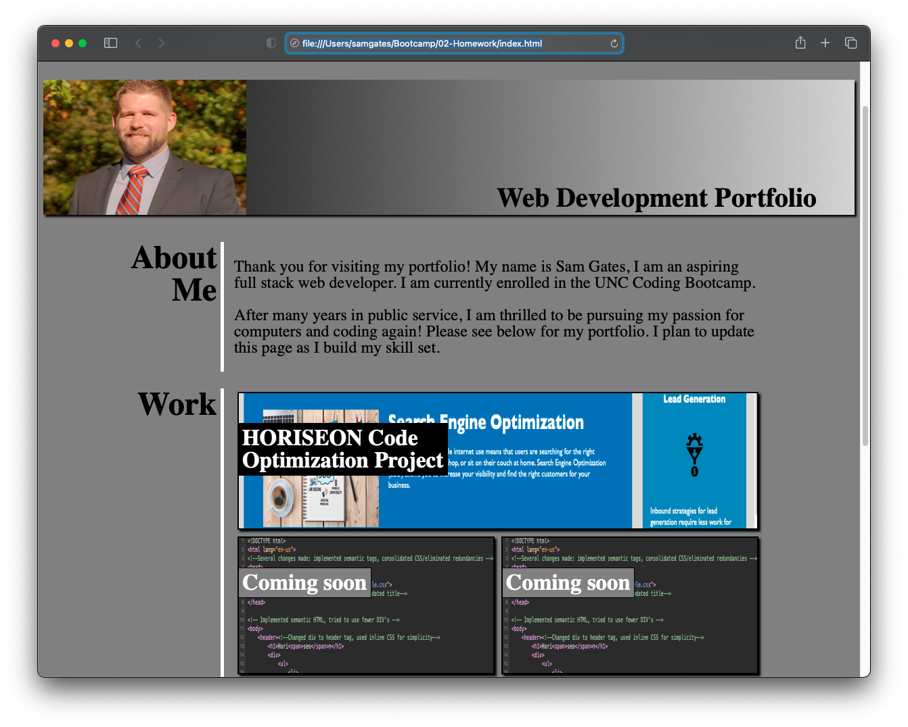
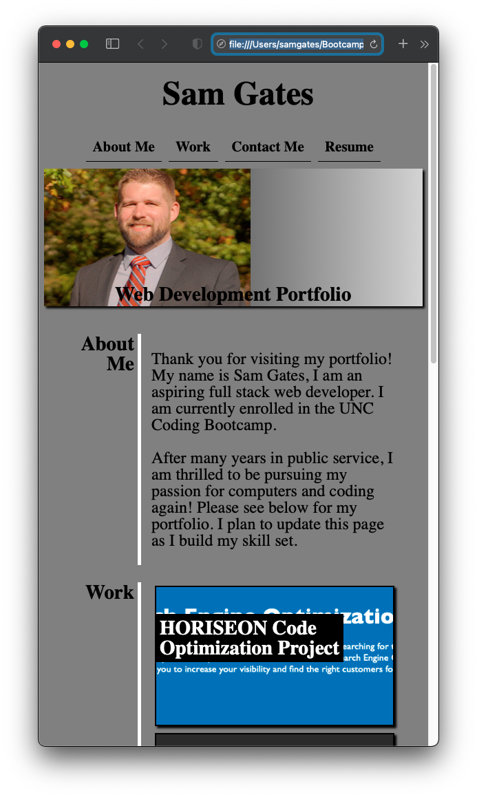

# Sam Gates Portfolio 

## Description

This homework assignment involved developing a website portfolio to showcase my deployed projects for viewing by potential employers and others. The criteria were as follows (copied from original readme):

```
GIVEN I need to sample a potential employee's previous work
WHEN I load their portfolio
THEN I am presented with the developer's name, a recent photo, and links to sections about them, their work, and how to contact them
WHEN I click one of the links in the navigation
THEN the UI scrolls to the corresponding section
WHEN I click on the link to the section about their work
THEN the UI scrolls to a section with titled images of the developer's applications
WHEN I am presented with the developer's first application
THEN that application's image should be larger in size than the others
WHEN I click on the images of the applications
THEN I am taken to that deployed application
WHEN I resize the page or view the site on various screens and devices
THEN I am presented with a responsive layout that adapts to my viewport
```

## Actions taken

1. I created a basic website using semantic HTML in the file index.html
2. I created a reset.css stylesheet to standardize the layout across browsers
3. I create a style.css stylesheet to format the HTML in index.html
4. The end result is a responsive portfolio website that satisfies the above criteria
5. I utilized GitHub to organize my code and easily track/make changes
6. All images are stored in Assets/images
7. Stylesheets are stored in Assets/css


## Link to deployed project

See the deployed project by following this link: https://sg0703.github.io/02_Gates-Portfolio/
See the code repository here: https://github.com/sg0703/02_Gates-Portfolio

## Screenshots


